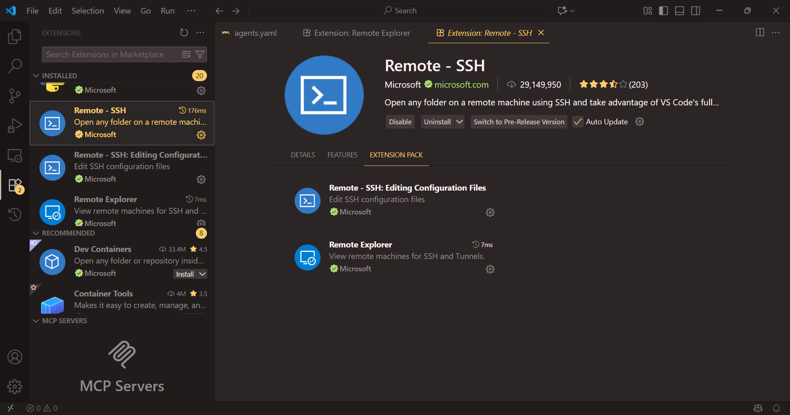
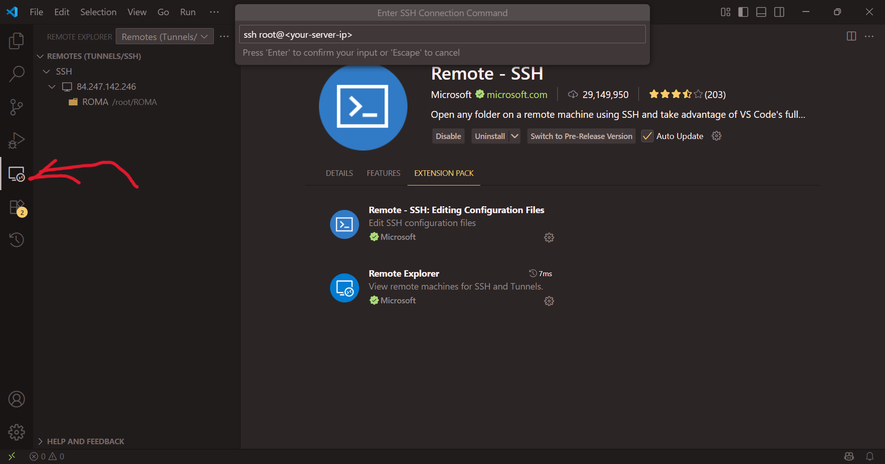
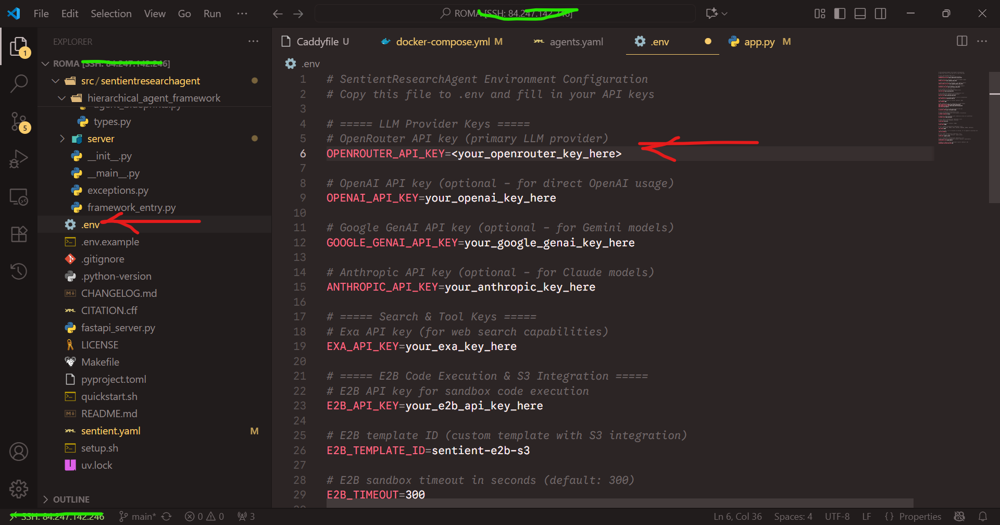

# Ultimate ROMA VPS Guide With PC UI/UX.

---

## Step 1: Get Remote-SSH package From VSCode Extension Marketplace. 

All you need to do here is install the extension package from the extension tab in vscode, make sure all the 3 packages highlighted in the image below are present. This package will give you the ability to view your VPS device as if it was your device.


## Step 2: Get A VPS from Contabo.

Next you need to get a VPS from Contabo.com, the lowest is all you need, cost around $5, you can use the Bybit virtual cards to make payments. it is easy.
If you already have other VPS service provider, you can use them too no problem.

- Visit: https://contabo.com/en/
- Select the lowest VPS.
- Make payments & your info is sent to your email where you'll see your server IP Address.
- Copy the server IP Address.

## Step 3: Connect Your VPS To Your VSCode.

Next thing you need to do is SSH your newly bought VPS to your VSCode.
- Click on the RemoteSSH tab.
- You'll see a "+" button.
- Click on it and SSH your VPS just as the same way you do in your terminal normally.
- Afterwards, click on the folder icon to load up your VPS files.

Follow image for reference. 

## Step 3: Setup Docker & Clone ROMA Repo.

You need to check if your server comes with docker & docker compose already, most VPS usually do, you can check using the command below:

```
docker --version
docker compose version
```
you should get version numbers as output in the terminal, if they have the docker & docker compose installed!, but if it doesn't give you the version number as output, then there is no installation! You can now install docker & docker compose with this command in that case:

```
curl -fsSL https://get.docker.com | sh
```
After then, clone the ROMA repo directly from github with the command below:

```
git clone https://github.com/sentient-agi/ROMA.git
```

## Step 4: Setup ROMA

Next thing is setting up ROMA for first time use, use the command below to set ROMA up
```
cd ROMA
./setup.sh --docker
```
That is the first step to getting ROMA up then you need to adjust some .env variables to use ROMA.

## Step 5: Environment Variables Configuartion.

To use ROMA, you need to provide the API key, this will give ROMA the ability to use the models in completing tasks. You don't need to provide all API keys, you can just use only OpenRouter API key and you're good to go.

- Visit: https://openrouter.ai/
- Create an account.
- You can deposit like $2 for a start.
- Navigate to Settings -> Keys -> Create API Key 
- Go back to VSCode.

In VSCode, you'll see your .env file in the rootfolder, similar to this 
```
# SentientResearchAgent Environment Configuration
# Copy this file to .env and fill in your API keys

# ===== LLM Provider Keys =====
# OpenRouter API key (primary LLM provider)
OPENROUTER_API_KEY=<this is where you'll paste the API key you copied>
```
Next is to edit your 'sentient.yaml' file too, also in your root folder.

```
# LLM Infrastructure (used by your AgnoAgents)
llm:
  provider: "openrouter"  # Since you're using OpenRouter
  api_key: <this is where you'll paste the API key you copied>
  timeout: 300.0  # Increased to 5 minutes for complex code execution and reasoning
  max_retries: 3
```


## Step 6: Configure ROMA Models

To kick things off, you can use free models for testing purposes but do note that they are actually so limited and can't be used for heavy tasks. 
- Go to your 'agent.yaml' at /src/sentientresearchagent/hierarchical_agent_framework/agent_configs/agents.yaml
- Copy all the contents of the script and save to your notepad on your computer to serve as backup.
- Then copy the same content and go to 'Sentient Chat' or "Gemini" in your browser, paste it and add this: 

```
Replace all model_id with z-ai/glm-4.5-air:free
```
- Copy the edited response and replace everything in your 'agent.yaml' file with it.

## Step 7: Restart Docker Containers

This is important, anytime you make changes to any file, you need to restart docker compose always, use the command below to do that:
```
cd docker
docker compose -f docker-compose.yml down
docker compose -f docker-compose.yml up -d
```

After this, you should be able to access your ROMA at 
### Backend
- http://localhost:500
- http://<your-VPS-IP-Address>:5000

### Frontend
- http://localhost:3000
- http://<your-VPS-IP-Address>:3000

### Step 8
That is the simple way of setting up ROMA. I'm still exploring more possibilities of minimizing costs of usage with the paid models when making API calls to the backend. Once I have something solid, I'll share an additional guide but for now, this is all you need!

GSenti 🤍
